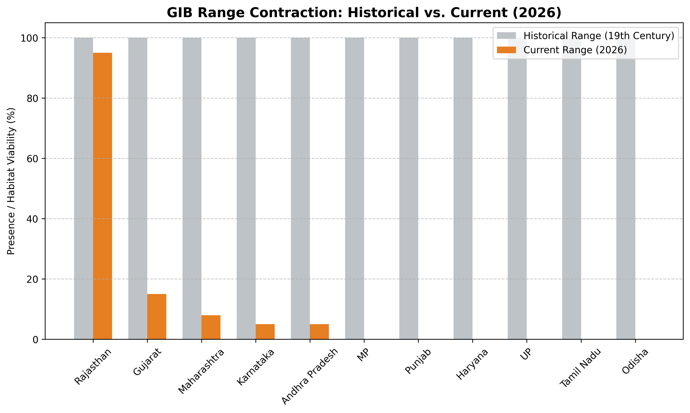
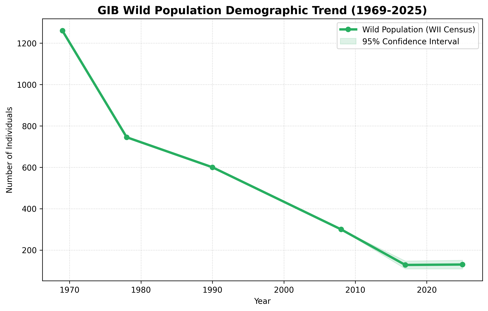
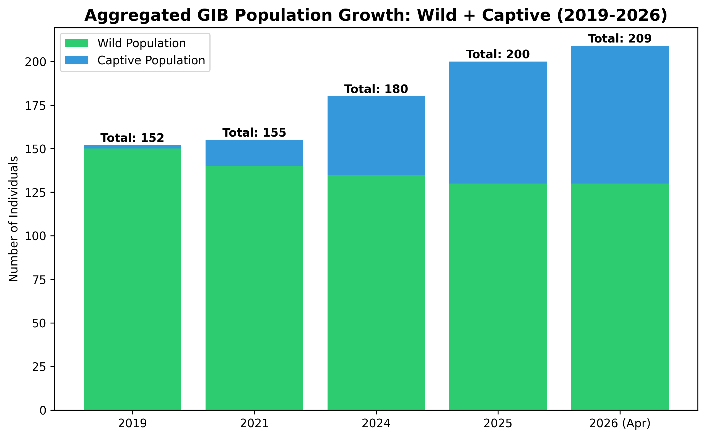
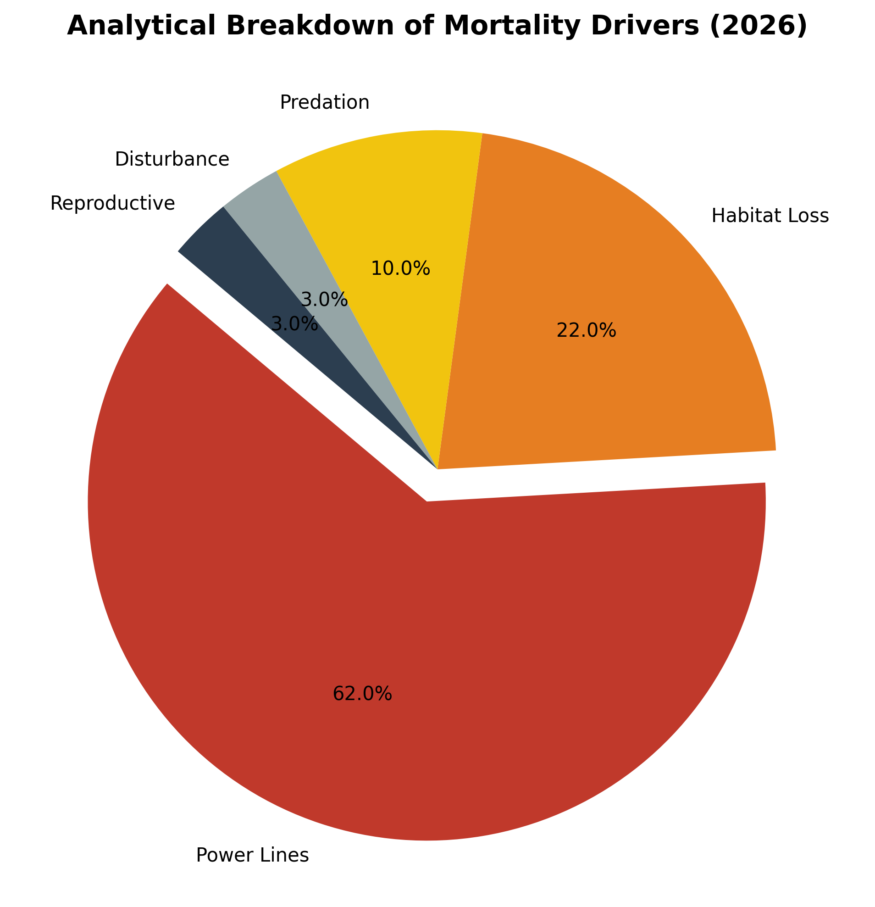

# Research Monograph v2.1: The Great Indian Bustard (Ardeotis nigriceps)
**Date: April 30, 2026 | Project: GIB-RECOVERY-2026**

## 1. Executive Summary
As of April 2026, the GIB population is estimated at **130 ±21 wild** and **79 captive** birds. Key milestones include the successful March 2026 'Jumpstart' egg translocation to Gujarat.

## 2. Taxonomy and Biological Profile
- **Kingdom**: Animalia | **Species**: Ardeotis nigriceps. 
- **Stats**: Weight 15-18kg, Wingspan 2.5m. 
- **Status**: Critically Endangered.

## 3. Historical and Current Distribution
The GIB has undergone a dramatic range contraction. Once found across 11+ Indian states, its range has shrunk by 90%.
- **Rajasthan**: ~100-150 birds (Thar Desert stronghold).
- **Gujarat**: ~5-20 birds (Kachchh/Naliya).
- **Other Pockets**: Maharashtra, Karnataka, and AP (tiny, fragmented groups).

## 4. Demographic Analysis (1969-2026)

- 1969: 1260 birds
- 2026: 130 wild + 79 captive

## 5. The Power Line Crisis

- **Impact**: 62% of adult mortality.
- **Policy**: SC Dec 2025 undergrounding mandate.

## 6. Land-Use Change & Grassland Degradation
- Conversion of 20,000+ hectares to solar/wind parks.
- Shift to pesticide-intensive cash crops.

## 7. Policy & Legal Framework
- **SC Ruling**: Dec 19, 2025.
- **Status**: Schedule I WPA 1972.

## 8. Ex-Situ Milestones
- **Jumpstart**: 770km egg translocation success in March 2026.
- **AI**: 12 chicks produced via Artificial Insemination in 2025.

## 9. India vs. World
- Highest priority among 26 bustard species globally.

## 10. Conclusion & Strategic Recommendations
1. SC 2025 Compliance.
2. Millet-based organic farming.
3. Community "Godawan Mitra" expansion.

## 11. References
- Dutta, S., et al. (2010); MoEFCC (2025); SC India (2025); WWF-India (2026).
