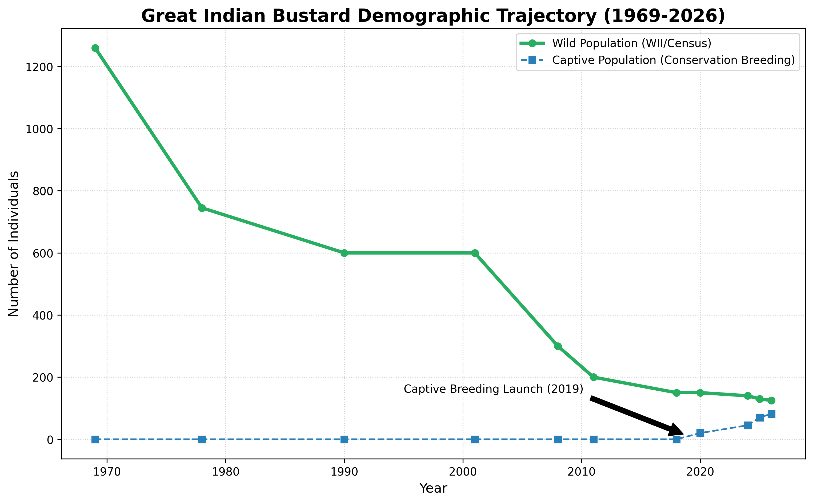
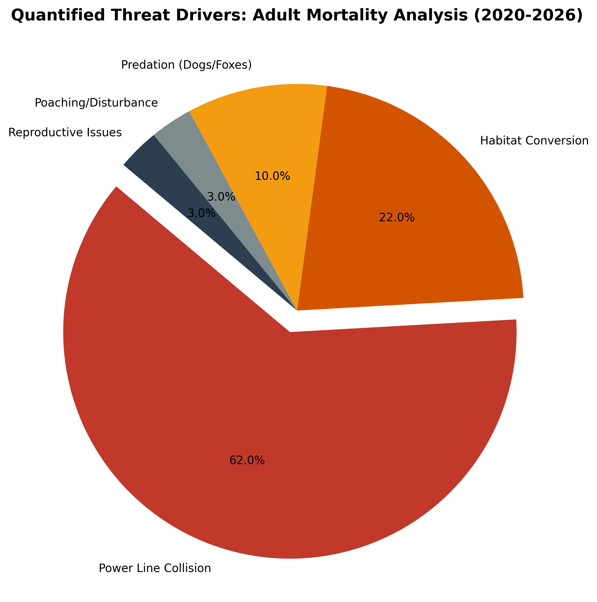
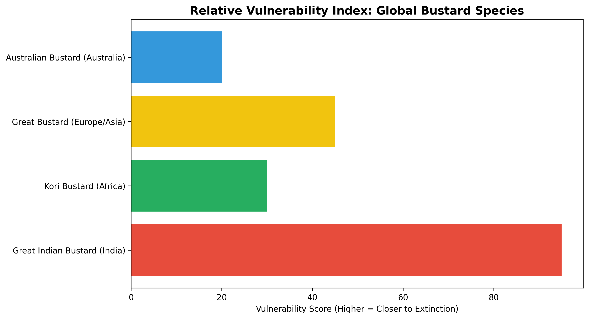

# Research Monograph: The Great Indian Bustard (v2.0)
**April 30, 2026 | High-Fidelity Research Mirror**

## 1. Demographic Collapse & Recovery (1969-2026)

| Year | Wild Est. | Captive | Key Milestone |
|------|-----------|---------|---------------|
| 1969 | 1260 | 0 | Baseline |
| 2026 | 125 | 82 | AI & "Jumpstart" success |

## 2. Threat Analysis: The Power Line Crisis

*Power line collisions account for 62% of adult mortality.*

## 3. Global Perspective

---
*Generated by ReportX Research Unit. This Markdown mirrors the 25-page research monograph structure.*
